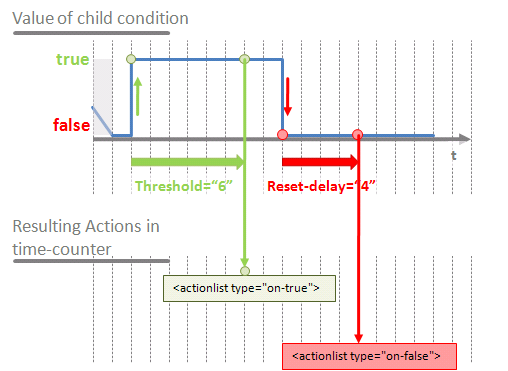
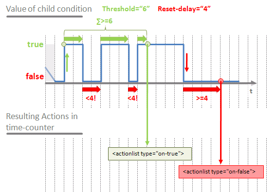

# General

The type of condition is determined by the `type` attribute.  
Supported values for this attribute are:
- for object-based conditions: [object](#object), [object-src](#object-src) and [object-compare](#object-compare)
- for logical conditions: [and, or, not](#logical-conditions)
- for time-based conditions: [timer](#timer) or [time-counter](#time-counter)
- for scripted condition: [script](#scripted-conditions)
- for interacting with an IO port: [ioport-rx](#ioport-rx)

# Object-based conditions

## object

The only attribute – optional – for this type of condition is `trigger`. Its value is either `true` or `false` and it defaults to `false`.
Setting the `trigger` attribute to `true` forces the rule to assess its top-level condition whenever the value of the timer condition changes. In other words, with `trigger` set to true, the status of the rule may change immediately upon a change of the timer condition. On the contrary, setting it to `false` does not force the rule to refresh its status after the sole change of the timer condition.
  
The state of an object condition depends on the value of the object whose identifier matches the value of the `id` attribute. The value of this object is compared to the value provided in the attribute `value`. The value of the `op` attribute defines the type of comparison operator which tells how the `value` of the condition is compared with the current value of the targeted object:
* `eq` (default): evaluates to true when the object value is equal to the condition value 
* `lt`: evaluates to true when the object value is less than the condition value 
* `gt`: evaluates to true when the object value is greater than the condition value 
* `ne`: evaluates to true when the object value is not equal to the condition value 
* `lte`: evaluates to true when the object value is less than or equal to the condition value 
* `gte`: evaluates to true when the object value is greater than or equal to the condition value 

Example:
```xml
<condition type="object" id="light_level" value="12" op="lt"/>
```

## object-src

This type of condition extends the behavior of [object conditions](#object) with a `src` attribute specifying a device's physical address (e.g. 1.1.20). For the object-src condition to evaluate to true, both conditions must be met:
- the object condition is true
- the last group telegram received for the configured group object was coming from the device holding the address specified in the `src` attribute 

## object-compare

This type of condition extends the behavior of [object conditions](#object). Instead of using a constant value defined in a `value` attribute, object-src conditions takes its reference value from a second object. That is why the `value` attribute is replaced with an `id2` attribute holding the identifier of a second object whose value is used as reference for the comparison.

Example of a condition evaluating to true when the value of `living_room_temp` is less than the value of `living_room_set_temp`:
```xml   
<condition type="object-compare" id="living_room_temp" id2="living_room_set_temp" op="lt"/>
```

### Restrictions
Objects referred to with `id` and `id2` must provide comparable values. As a consequence, the types of the two objects must be compatible.
Supported associations of types are:  
- 9.xxx and 14.xxx (floating point 16 and 32bit)  
- 5.xxx, 5.001, 5.003, 20.102, 7.xxx and 12.xxx (these types all internally rely on an unsigned integer)
- 6.xxx, 8.xxx and 13.xxx (these types all internally rely on a signed integer value; 29.xxx is not compatible because it uses a 64 bit integer)  
- 16.000 and 28.001 (those represent strings of characters)

# Logical conditions

This section corresponds to condition with a type equal to `and`, `or` or `not`.

The only attribute for these is `type`. Conditions of type `and` or `or` can have one or several children conditions, while condition of type `not` can only have one.
As expected, their behavior is as follows:
- `and` conditions evaluate to `true` if all child conditions evaluate to `true`.
- `or` conditions evaluate to `true` if at least one child condition evaluates to `true`.
- `not` conditions negates their child condition. As a consequence, they evaluate to `true` if and only if the child condition evaluates to `false`.

# Time-based conditions

## timer

Timer conditions have an optional `trigger` boolean attribute which defaults to `false` and whose role is the same as the `trigger` attribute for [object conditions](#object).

This type of condition is defined by means of its children elements. They can be:
- `at`
- `every`
- `until`
- `during`

Elements `at` and `every` are mutually exclusive. One of the two **must** be present for the condition to be valid.
Elements `until` and `during` are mutually exclusive. Their presence is optional.
For details about attributes for `at` and `until`, please refer to section about the [time specification](Time-Specification) section.
Elements `every` and `during` cannot have attributes. Their internal text value defines a period of time in seconds.  
At the time specified by `at` or time interval specified by `every` , the timer condition evaluates to `true`.
When the time specified by `until` is reached or when the time duration specified by `during` is expired, the timer condition evaluates to `false`.
If neither `until` nor `during` are specified, the timer condition expires instantaneously. That means that when scheduling constraints are met, the timer condition briefly evaluates to `true`, causing the rule to re-evaluate if `trigger` is `true` and immediately resets to `false`.
Please note that you can force the timer condition to remain `false` on exception days, by setting `exception="no"`. Exception days requiring special treatment are defined in the [services](Services) section.

### Comments

* Please note that you can use a combination of timer conditions where some are used to trigger evaluation at a given time and others set the timeframe when a condition can be valid.
The example below illustrates this feature with a condition that should trigger every day at 8:00 AM in the period ranging from mid-September to mid-March.
```xml
<condition type="and">
    <condition type="timer">
        <at day="15" month="9" hour="0" min="0"/>
        <until day="15" month="3" hour="0" min="0"/>
    </condition>
    <condition type="timer" trigger="true">
        <at hour="8" min="0"/>
    </condition>
</condition>
```

* Any parts of the time specification can be omitted. For example, the condition below evaluates to `true` every day of February because it does not define any constraint on the day of month: 

```xml        
<condition type="timer" trigger="true">
    <at hour="8" min="12" month="2" exception="no"/>
</condition>
```

## time-counter

This type of condition was introduced in version 0.0.1.25.

### Definition
In addition to [simple timer conditions](#timer) and to the `delay` attribute in [actions](Actions), `time-counter` conditions are a flexible way of defining rich time-based conditions.
Its definition consists of:
- a `threshold` attribute
- a `reset-delay` attribute
- a child element of type `condition`

The state of a `time-counter` condition depends on the state of its child condition. It evaluates to `true` once the child condition has remained `true` for a `threshold` period of time.
Once the child condition has remained `false` for a `reset-delay` period of time, the state of the condition switches back to `false.

### Example
```xml   
<objects>
	<object id="Test_Switch1" gad="10/5/15" type="1.001" flags="cwtus">Test_Switch1</object>
	<object id="Test_Switch2" gad="10/5/16" type="1.001" flags="cwtus">Test_Switch2</object>
</objects>
<rules>
	<rule id="TestTimer">
		<condition type="time-counter" threshold="6" reset-delay="4">
			<condition type="object" id="Test_Switch1" value="on" trigger="true"/>
		</condition>
		<actionlist>
			<action type="set-value" id="Test_Switch2" value="on"/>
		</actionlist>
		<actionlist type="on-false">
			<action type="set-value" id="Test_Switch2" value="off"/>
		</actionlist>
	</rule>
</rules>
``` 

In this example the child condition is `<condition type="object" id="Test_Switch1" value="on" trigger="true"/>`
The behavior can be illustrated as in the diagram below:



### Advanced
The `time-counter` is also designed to take short spikes into account. The time the child condition remains true is not measured in one chunk. This time sums up until the value indicated by `threshold` is reached. On the other hand, if the sum of time chunks spent with the child condition being false reaches the duration specified in `reset-delay`, the counter starts over.
This is illustrated in the diagram below:



### Description of a Scenario
Let's take the example of an audio baby monitor device that we would like to trigger a rule when it detects noise for a long-enough period of time. In order to limit false positive due to environmental noise, let's define the condition so that it evaluates to true after the sum of noisy time chunks is 15 seconds long. The counter should reset after 5 minutes of silence.
The condition to define is then:
```xml    
<condition type="time-counter" threshold="15" reset-delay="5m">
    <condition type="object" id="babyphone" value="on" trigger="true"/>
</condition>
```
 
Another use case can be to tell short and long button presses apart. This type of condition can help to emulate short and long presses on wall buttons which do not natively support that feature (such as BIQ switches without temperature control).

# Scripted conditions

A script condition is a LUA script that is executed when the rule is evaluated. The return value is interpreted as a boolean. 

Example:
```xml
<condition type="script">
    return tonumber(obj("setpoint_room1")) &gt; tonumber(obj("temp_room1"));
</condition>
```

Until version 0.0.1.28, the condition was evaluated twice. So be careful if you reuse variables from one execution to the other, or if you display some text with Lua print function, it will be executed twice. This bug is corrected since 0.0.1.28. 

See [this page](lua-scripting) for more details about Lua scripting.

# IOPort RX

To be documented.
